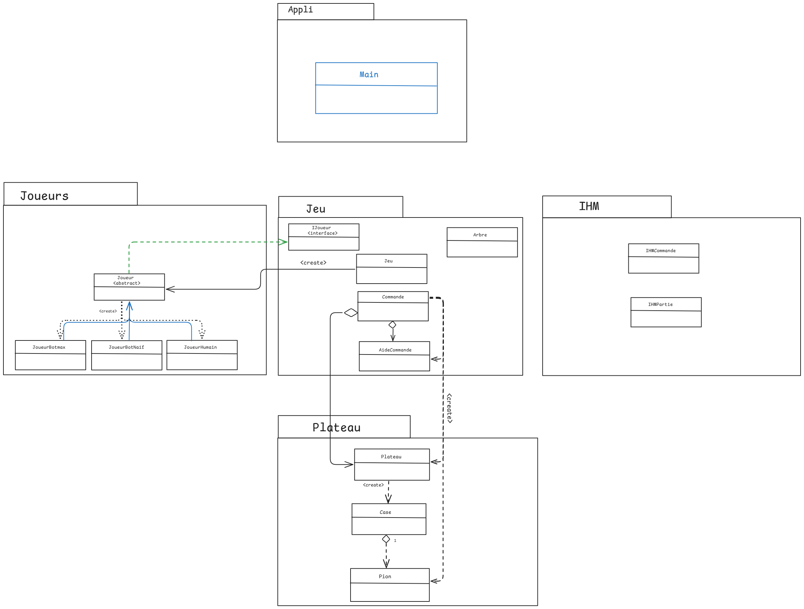

 **Projet R304**

	
 _AYINDE ALYA NESRINE HAJJEM LEONA TRAN AMINA KARMENOVA GROUPE 208-207_

	
 + Toutes les fonctions demandées fonctionnent.Notre projet se connecte a GoGui.
 
 set_player pour lancer une partie fonctionnent de la manière suivante :

 set_player couler type (on a 3 type human ,randomBot,minimax)

  

+ Diagramme de dépendances : 

+ Nos 7 tests unitaires passent

+ Le plus compliqué était de coder tout en respectant les principes SOLID, sachant que l'on les apprenait au même moment. Notre code était donc sans cesse en permanente évolution pour essayer d'appliquer au mieux les principes et les notions de patterns vus en cours.
